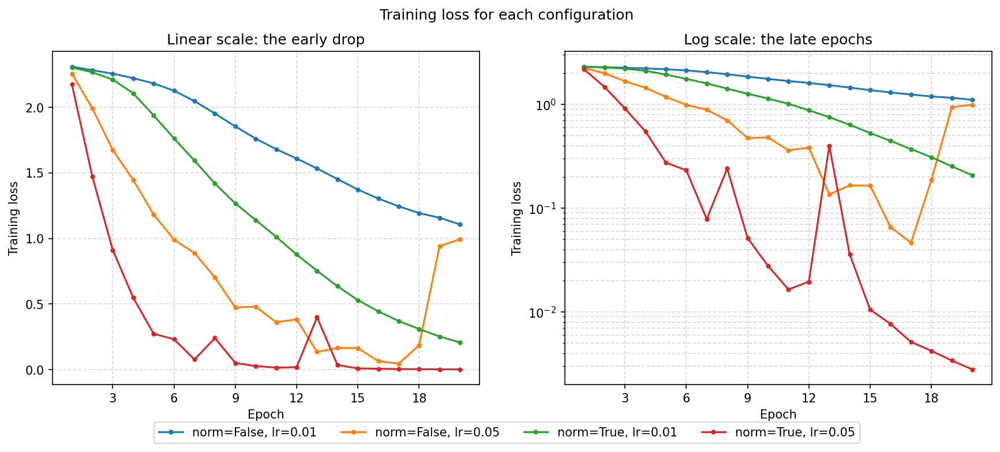

# 04 – Fruit Network (Backpropagation)

Learning notes on the PyTorch pieces used here: see [NOTES.md](NOTES.md).

## What this is
A 4-layer fully connected network (10 neurons per layer) that classifies images of 10 kinds of fruit and vegetable. It is trained with PyTorch, where `loss.backward()` performs backpropagation automatically and an SGD optimizer applies the gradient descent updates.

Until now, every topic was written from scratch with a tiny truth table as the data. This one introduces a real image dataset, mini-batches, a loss function, and gradients computed by backpropagation.

## Architecture
```
400 inputs ──► 10 ──► 10 ──► 10 ──► 10 outputs
 (20×20)     ReLU   ReLU   ReLU   (logits, one per class)
```

- **Input:** a 20×20 grayscale image, flattened to 400 numbers.
- **Layers:** four `nn.Linear` layers, with ReLU after the first three. The last layer outputs raw scores (logits).
- **Loss:** `CrossEntropyLoss`, which applies softmax internally, so the network has no softmax layer.

## Dataset
[Fruits-360](https://www.kaggle.com/datasets/moltean/fruits) by Mihai Oltean, `fruits-360_100x100` version, using 10 of its classes:

`Apple 20`, `Banana 3`, `Blueberry 1`, `Cantaloupe 1`, `Cucumber 3`, `Kiwi 1`, `Mango 1`, `Orange 1`, `Peach 1`, `Pineapple 1`

The number of training and test images per class is in the results table below.

**Preprocessing:** resize to 20×20, convert to grayscale, scale pixels to [0, 1], then normalize to [-1, 1].

## Files
- `data.py`: `get_loaders()` builds the train and test `DataLoader`s (batches of 32, training data shuffled).
- `model.py`: the `FruitNetwork` class.
- `train.py`: the training loop (zero gradients, forward, loss, `backward()`, optimizer step).
- `demo_gradients.py`: runs backpropagation once on a single batch and prints the evidence: the gradient before and after `backward()`, one weight's update checked against `-lr × grad`, and the loss before and after.
- `experiments.py`: trains four fresh networks (normalization on or off, two learning rates, same seed) and saves their per-epoch losses to `experiments.json`.
- `plot_losses.py`: plots those four loss curves into `loss_curves.png`.
- `evaluate.py`: loads the saved weights and measures accuracy on the training and test images, per class, with the most common mistakes.
- `test_model.py`: tests for the network, one optimizer step, training on a single batch, and the evaluation code.
- `NOTES.md`: personal learning notes explaining the code line by line.

## How to run
The images are not stored in this repo (`data/` is gitignored). To set them up:

1. Download the dataset from Kaggle and unzip it.
2. Copy the 10 class folders listed above from the `Training` and `Test` folders of `fruits-360_100x100` into `04_fruit_network/data/train/` and `04_fruit_network/data/test/`.

Then, from inside the `04_fruit_network` folder (the files import each other by name):

```
pip install -r ../requirements.txt
python data.py      # checks the loaders: shapes and class names
python train.py     # trains the network, prints the loss per epoch, saves fruit_net.pt
python demo_gradients.py   # one backpropagation step, with the evidence printed
python experiments.py      # trains the four configurations, saves experiments.json
python plot_losses.py      # draws loss_curves.png from experiments.json
python evaluate.py         # accuracy on the train and test images, per class
python test_model.py       # runs the tests (no dataset needed)
```


## Training setup
- Optimizer: plain SGD, 20 epochs, batch size 32
- Seed: `torch.manual_seed(20)` for repeatable runs
- Chosen settings: normalization on, learning rate 0.05. They were chosen from the training-loss curves below, not from test accuracy, and the final weights are saved to `fruit_net.pt`.

## Experiments
Four 20-epoch runs, changing the normalization and the learning rate:

<!-- After re-running experiments.py, replace this table with the one it prints and delete the "run before seeding" note. -->

| Run | Loss at epoch 1 | Loss at last epoch | Lowest loss (epoch) |
|-----|-----------------|--------------------|---------------------|
| norm=False, lr=0.01 | 2.3090 | 1.1073 | 1.1073 (20) |
| norm=False, lr=0.05 | 2.2555 | 0.9939 | 0.0465 (17) |
| norm=True, lr=0.01 | 2.3027 | 0.2079 | 0.2079 (20) |
| norm=True, lr=0.05 | 2.1737 | 0.0028 | 0.0028 (20) |

**What this suggests:**
- Normalizing the inputs helped at both learning rates.
- A larger learning rate trains faster but less steadily.
- The first loss is close to `ln(10) ≈ 2.30`, which is what a 10-class network that is guessing should give.

These are training losses from single runs, so they show how training behaves, not how well the network classifies new images. The first row was run before the seed was fixed.

## Results
### Backpropagation on one batch
`demo_gradients.py` runs one forward and backward pass on a single batch of 32 images (seed 42, learning rate 0.01), then one optimizer step:

```
Gradient before backward(): None

--- Weight Update Demonstration ---
Initial Loss: 2.303889
Selected Weight Index: (0, 6)
Initial Weight: -8.424e-02
Gradient: -4.399e-02

--- Gradient Norms Across Layers ---
Layer 'fc1.weight' Gradient Norm: 1.252e-01
Layer 'fc1.bias' Gradient Norm: 7.987e-03
Layer 'fc2.weight' Gradient Norm: 1.793e-02
Layer 'fc2.bias' Gradient Norm: 1.750e-02
Layer 'fc3.weight' Gradient Norm: 3.245e-02
Layer 'fc3.bias' Gradient Norm: 5.082e-02
Layer 'fc4.weight' Gradient Norm: 9.480e-02
Layer 'fc4.bias' Gradient Norm: 2.342e-01

--- Post-Step Verification ---
Updated Weight: -8.380e-02
Actual Change: 4.399e-04
Expected Change (-lr * grad): 4.399e-04
Matches Expected Update (within tolerance): True

Loss Before Step: 2.303889
Loss After Step: 2.303051

Note: The optimizer step updated 4166 out of 4340 parameter entries (weights with non-zero gradients).
```

What it shows:
- **No gradient exists before `backward()`**, and afterwards every layer has a non-zero gradient, including `fc1`, the layer furthest from the loss. The gradient flowed back through the whole network.
- **The weight moved by exactly `-lr × grad`.** Its gradient was negative, so the weight increased.
- **The loss on the same batch fell** from 2.303889 to 2.303051. That drop matches the first-order prediction, `lr` times the sum of the squared gradient norms (0.01 × 0.0838 ≈ 8.4e-4).
- **The starting loss, 2.30, is `ln(10)`**, which is what a network guessing among 10 classes gives.
- **4166 of the 4340 parameter entries changed** in this one step.

### Training loss


The left panel uses a linear axis and shows the early drop. The right panel uses a log axis, so the late epochs and the bumps stay visible.

### Test accuracy
`evaluate.py` loads the saved weights and measures accuracy on the held-out test images, which the network never trained on.

Train accuracy: 100.0%
Test accuracy:  91.4%

| Class | Train images | Test images | Test accuracy |
|-------|--------------|-------------|---------------|
| Apple 10 | 699 | 231 | 100.0% |
| Avocado 1 | 427 | 143 | 68.5% |
| Banana 1 | 490 | 166 | 88.6% |
| Blackberry 1 | 450 | 150 | 100.0% |
| Cabbage red 1 | 149 | 49 | 100.0% |
| Carrot 1 | 151 | 50 | 100.0% |
| Pear 1 | 492 | 164 | 100.0% |
| Pineapple 1 | 490 | 166 | 99.4% |
| Pomegranate 1 | 492 | 164 | 87.8% |
| Watermelon 1 | 475 | 157 | 75.2% |
| **All** | 4315 | 1440 | 91.4% |

<!-- FILL: one or two sentences on the most common mistakes it prints, and on the gap between train and test accuracy -->

The Fruits-360 photos come from fruit being rotated, so many images look nearly identical. Test images can therefore resemble training images closely, and the test accuracy may overstate how well the network would do on fruit photographed differently.

## Notes
- The loss is only meaningful alongside test accuracy: a very low training loss can also mean the network memorized the training images.
- The images are small and grayscale, and the network is a plain fully connected one, so this exercise is about showing backpropagation, not about reaching the best possible accuracy.